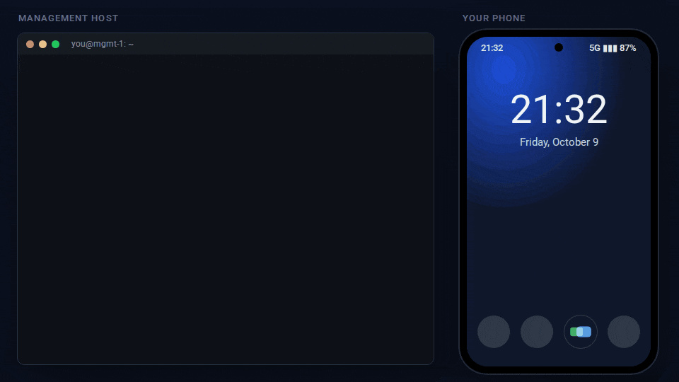
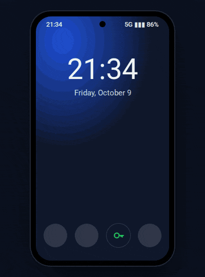
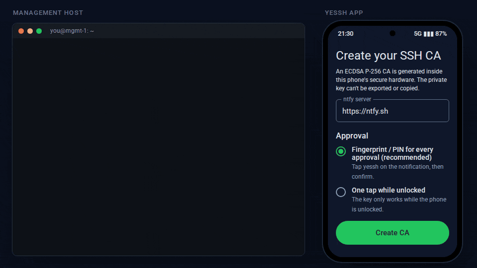
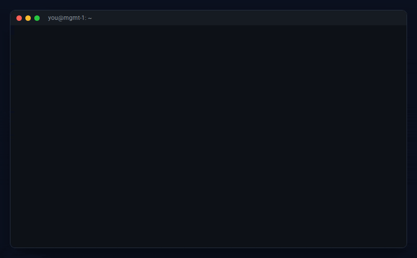

<h1 align="center">
  <picture>
    <source media="(prefers-color-scheme: dark)" srcset="docs/brand/yessh-wordmark-dark.svg">
    
  </picture>
</h1>

<p align="center">Phone-held SSH certificate authority with an approval tap for every certificate.</p>



An Android app holds the CA key in the phone's secure hardware and signs short-lived SSH user
certificates on request. The `yessh` CLI on your management host asks for a certificate through
an untrusted [ntfy](https://ntfy.sh) relay. You tap **`yessh`** on the notification, confirm with
your fingerprint, and the host gets a certificate valid for an hour or so. Fleet hosts trust only
the CA public key.

- **No long-lived SSH key on the management host.** Only an ephemeral key and a cert that expires.
- **Every certificate needs a tap on your phone**, and the phone logs it.
- **The relay is untrusted.** Messages are end-to-end encrypted and the host verifies every
  certificate itself. A compromised relay can only delay or drop requests.
- **The CA key never leaves the phone's secure hardware** (Android Keystore, StrongBox when
  available).

## On the phone

Tap the notification body instead of the button to review a request: untick principals, lower the
TTL, then approve. Every decision lands in the log.



Two approval modes, chosen when you create the CA:

- **Fingerprint / PIN for every approval** (default). The key itself refuses to sign without a
  fresh confirmation.
- **One tap while unlocked.** The key only works while the phone is unlocked.

See [android/README.md](android/README.md) for installing, signing and the security details.

## Setup

Create the CA in the app, then paste its pairing string into a shell on the management host.
Put the CA line on your fleet hosts.



```sh
cd host && go build -o ~/.local/bin/yessh ./cmd/yessh
yessh pair 'yessh1:…'                      # type or paste it yourself, never via a coding agent
yessh ca | ssh root@web1 'cat >> /etc/ssh/yessh_ca.pub'
# on each fleet host, in sshd_config:  TrustedUserCAKeys /etc/ssh/yessh_ca.pub
```

Then let `ssh` fetch certificates on demand (`~/.ssh/config`):

```
Match host *.internal exec "yessh ensure -p root"
    IdentityFile ${XDG_RUNTIME_DIR}/yessh/id_yessh
    CertificateFile ${XDG_RUNTIME_DIR}/yessh/id_yessh-cert.pub
    IdentitiesOnly yes
```

Full walkthrough: [docs/setup.md](docs/setup.md).

## The CLI



| Command | |
|---|---|
| `yessh pair '<string>'` | Store the config (0600) and print the CA line. |
| `yessh ca` | Print the CA public key line, for `TrustedUserCAKeys`. |
| `yessh request [-p principal]… [-t 1h] [--label L]` | Ask the phone for a new certificate. |
| `yessh ensure [-p principal]… [--min-remaining 10m]` | Reuse a valid cert silently, or request one. |
| `yessh status` | Show principals, expiry and fingerprints. |
| `yessh forget` | Delete the ephemeral key and certificate. |

Exit codes: `0` ok, `1` error (including a tampered response), `2` timeout, `3` denied on the phone.

## Repository

- `android/`: the phone app (`app/`) and its Kotlin protocol engine (`core/`).
- `host/`: the Go CLI. `go test ./...`
- `e2e/`: docker compose (ntfy + sshd). `e2e/run.sh` drives the real binary against the app's
  engine and logs in over ssh.
- `docs/`: [setup](docs/setup.md), [threat model](docs/threat-model.md). The animations above are
  rendered from `docs/media/src` (`npm install && node render.mjs`). The terminal output is the
  real CLI's; the phone screens are re-created from the app's UI.
- `docs/brand/`: wordmark, mark, app icon and social preview, generated by `docs/brand/src/build.mjs`
  (which also writes the Android launcher and notification icons).
- [SPEC.md](SPEC.md): the original design. The phone side started as a PWA and has since been
  replaced by the Android app; the wire protocol is unchanged.

Keep a break-glass path to your fleet until you've proven the flow.

## License

yessh is free and unencumbered software released into the public domain under
[the Unlicense](https://unlicense.org). See [LICENSE](LICENSE).

Third-party components keep their own licenses. The Go CLI uses `golang.org/x/crypto`
(BSD-3-Clause). The Android app bundles AndroidX, Jetpack Compose, kotlinx.serialization,
kotlinx.coroutines and ZXing (all Apache-2.0). The wordmark is drawn from Inter outlines and
the README animations use Roboto and JetBrains Mono (all SIL OFL 1.1).
